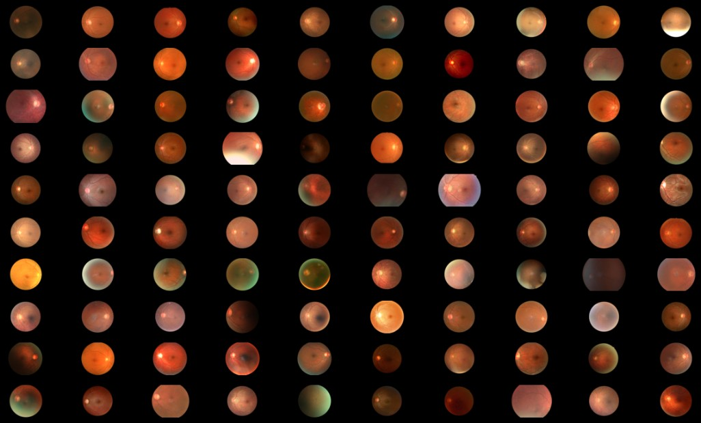

# <p style="text-align: center;">Sex prediction from retinal fundus image using deep learning</p>


>>> According to the investigation, a challenge in the structural component extraction from
fundus images is the extraction of the retinal vasculature





## The problem

The examination of the optic fundus consists of observing the structures of the posterior segment of the eye (optic nerve head, retina, retinal vessels, and choroid). This exam can diagnose several diseases: ocular hypertension, arteriosclerosis, diabetes, glaucoma, vascular occlusions (both arterial and venous system), nephropathy, and brain tumors, among others.

Ophthalmologists are not trained to identify the gender from fundus images. Even though this is not as useful as predicting diseases, predicting gender from eye fundus images using deep learning can demonstrate how this technique can support the decision-making process in healthcare. 

Here we'll predict gender from retinal fundus image using a convolutional neural network (CNN).


## The data

Ocular Disease Intelligent Recognition is a structured ophthalmic database formed by 10,000 fundus images from 5,000 clinical patients containing age, color fundus photographs from left and right eyes, and doctors' diagnostic keywords from doctors (ODIR-5K). 

This anonymized dataset was collected by Shanggong Medical Technology Co., Ltd. from different hospitals/medical centers in China where fundus images were captured by different leading to varied image resolutions. 

Annotations were labeled by trained professionals with quality control management which classified patients into eight labels based on both eye images and additionally patient age:
* normal (N), 
* diabetes (D), 
* glaucoma (G), 
* cataract (C), 
* AMD (A), 
* hypertension (H), 
* myopia (M) and 
* other diseases/abnormalities (O) 

The dataset can be obtained following the instructions available at this [GitHub repository](https://github.com/nkicsl/OIA-ODIR). It is splited into three parts, the training set, the off-site test set (used as validation set), and the on-site test set (used as test set) which contains 3,500, 500 and 1,000 patients, respectively.

To predict the gender we'll use only normal fundus images. In the case the left or right eye image is labeled as not normal, we won't use it. These images we'll be stored in a data directory with the following structure:

```bash
├── test
│   ├── female
│   └── male
├── train
│   ├── female
│   └── male
└── val
    ├── female
    └── male
```

# Modeling

## Transfer learning
* Xception
* InceptionV3
* MobileNetV2


## Model architecture: 3


## Augmented images
Using `preprocessing layers` (image preprocessing and image augmentation) and the the modulo `tf.image`


## Adaptable learning rate (LearningRateScheduler)

## Optimizers
* SGD
* Adam
* RMSprop


## Autokeras

Autokeras is an auto machine learning library that helps finding the best model for a specific data. It's easy to use, but I just tried once for the sake of comparison.


## Cloud Platforms

I ran the calculations using my free tier account in three cloud platforms:
* [Saturn Cloud](https://saturncloud.io/) 
    * Everything works fine, it's easy to use and it's avaible when you need.
* [Sagemaker Studio Lab](https://studiolab.sagemaker.aws/)
    * Everything works fine if you have luck to scape from this message: _There is no runtime available right now. Please change the compute type or try again later._. And, it can crash during calculations.
* [Google Colab](https://colab.research.google.com/)
    * Slower and instable (it can crash during calculations).

